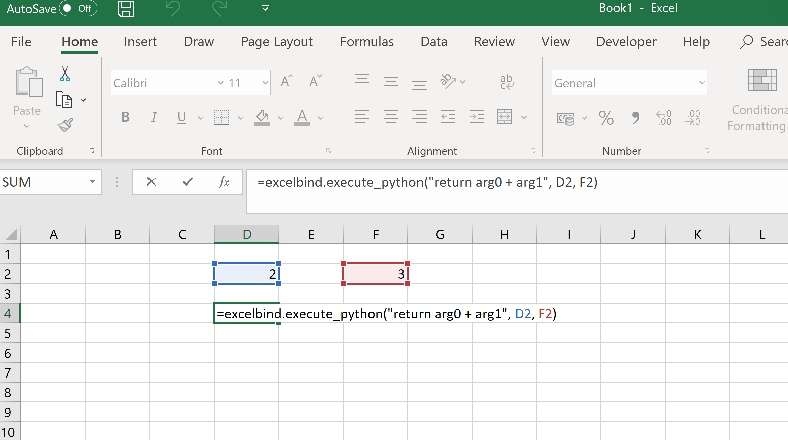

Examples
========

Below we go through a few basic examples on how to use Excelbind. You can find more examples in the examples folder in the `Github source repository <https://github.com/RuneLjungmann/excelbind>`_.

Exposing python functions
-------------------------

To get started, just import the ``excelbind`` library in your code and
then use the ``excelbind.function`` decorator to mark the functions you want to export.
The Excelbind library is automatically part of the builtin libraries in the embedded interpreter that Excelbind uses,
so you don't need to install any packages yourself. You can simply write::

    import excelbind

    @excelbind.function
    def add(x, y):
        return x + y

As described in the :doc:`type_conversion`, it is better to include type hints in your function when possibly.
If you add comments to your code, Excelbind will also automatically pick these up and expose them in the function wizard::

    import excelbind

    @excelbind.function
    def add(x: float, y: float) -> float:
    """ Adds two numbers together!

    :param x: The first number
    :param y: The second number
    :return: The sum!
    """
        return x + y

You can easily combine Excelbind with other libraries such as numpy::

    import excelbind
    import numpy as np

    @excelbind.function
    def inv(x: np.ndarray) -> np.ndarray:
        """Matrix inversion

        :param x: An invertible matrix
        :return: The inverse
        """
        return np.linalg.inv(x)

Execute python code directly from Excel
---------------------------------------
Excelbind lets you execute python code directly in Excel using the *excelbind.execute_python* function.

The function wraps your input code in a simple python function which takes up to 10 arguments.
The arguments can be referenced in the function using the names *arg0*, *arg1*, ..., *arg9*.
The function accept any of the auto discoverable types such as floats, strings, lists and dictionaries.

You can also perform more advanced operations inside the *execute_python* function, such as import libraries, open files etc.
The execution happens inside a local python function, so import statements or local variables in one function will not affect other functions.
